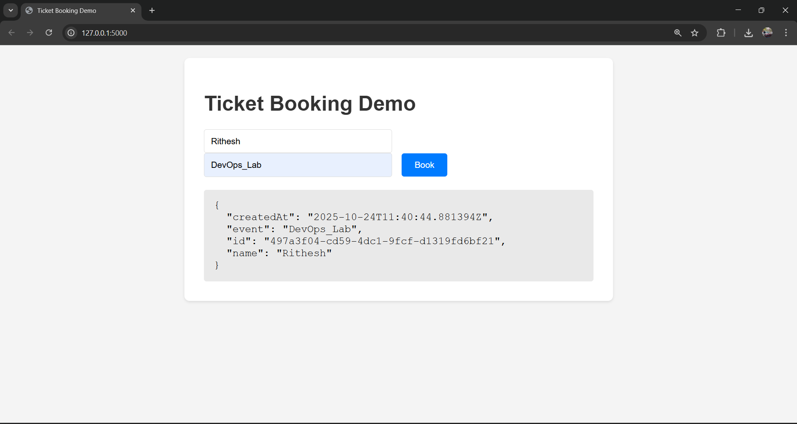
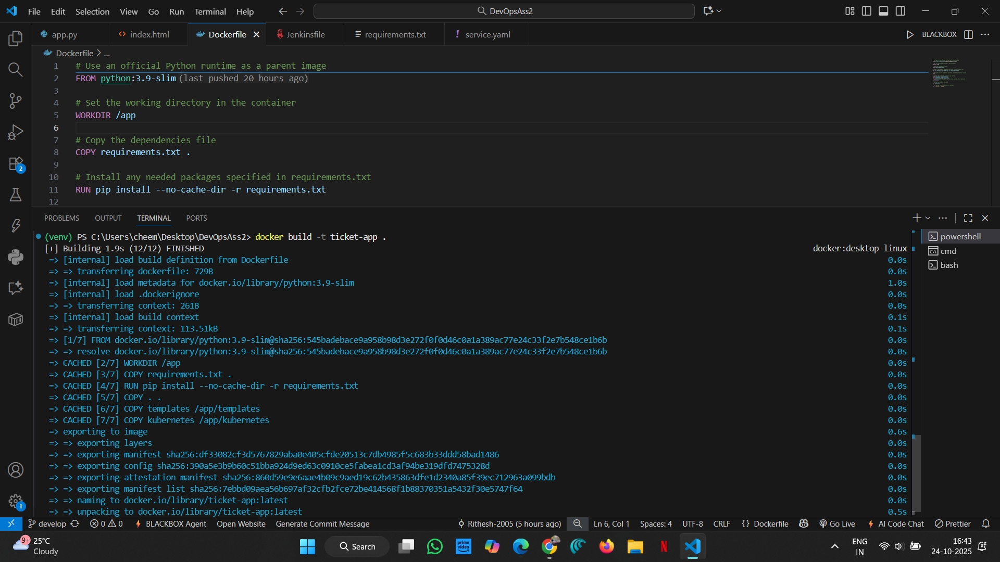
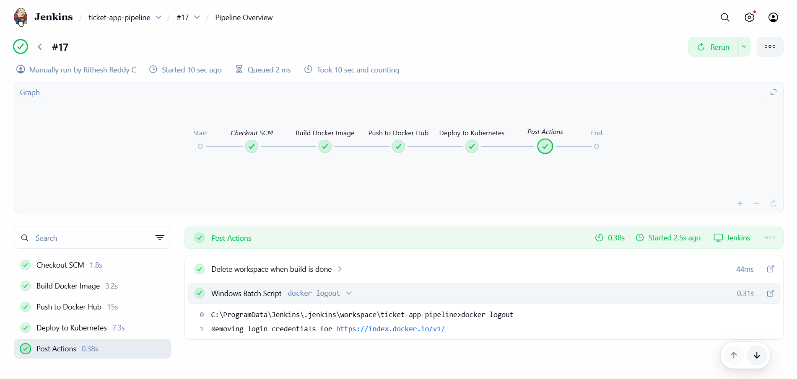
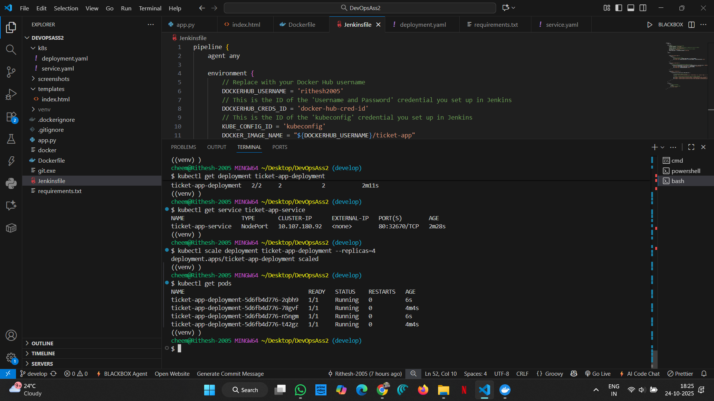

# DevOps CI/CD Pipeline for a Ticket Booking Application

## 1. Problem Statement

To design and implement a complete, automated CI/CD workflow for a web-based ticket booking application using Git, Docker, Jenkins, and Kubernetes.

---

## 2. Repository Structure

```
DevOps_Assignment_02/
│
├── .gitignore            # Files to be ignored by Git
├── Dockerfile            # Instructions to build the Docker image
├── Jenkinsfile           # The Declarative Pipeline script for Jenkins
├── app.py                # The Python Flask web application
├── requirements.txt      # Python dependencies (Flask)
├── README.md             # This readme file
│
├── k8s/                  # Kubernetes manifest files
│   ├── deployment.yaml   # K8s deployment manifest
│   └── service.yaml      # K8s service manifest
│
└── templates/            # HTML templates for the Flask app
    └── index.html        # Simple UI for the application
```

---

## 3. Overview 🚀

This project demonstrates a complete, automated DevOps workflow. The process is as follows:

1.  A developer pushes new code (e.g., a new feature) to the `develop` branch on GitHub.
2.  A GitHub webhook notifies the Jenkins server of the change.
3.  Jenkins automatically triggers a new pipeline build.
4.  The pipeline builds a new Docker image of the application.
5.  This new image is tagged and pushed to Docker Hub.
6.  The pipeline then securely connects to a Kubernetes cluster and deploys the new image by updating the deployment.
7.  Kubernetes handles the rolling update, ensuring zero downtime.

**Tools Used:**
* **Version Control:** Git & GitHub
* **Containerization:** Docker & Docker Hub
* **Continuous Integration/Delivery:** Jenkins
* **Orchestration:** Kubernetes (via Docker Desktop)

---


## 4. Version Control and Branching (Git)

This project uses the **GitFlow** branching strategy to manage developmen.

* `main`: This branch holds production-ready code. No direct commits are allowed.
* `develop`: This is the primary integration branch. All features are merged here before being released. Our Jenkins pipeline is triggered by pushes to this branch.
* `feature/*`: New features are built on branches off of `develop` (e.g., `feature/add-ui`).

### Steps and Commands:

1.  **Initialize the repository:**
    ```bash
    git init
    ```

2.  **Create the main branches:**
    ```bash
    # Create the develop branch
    git checkout -b develop
    
    # Add all files and make the first commit
    git add .
    git commit -m "Initial project setup"
    
    # Create the main branch from develop
    git checkout -b main
    git checkout develop
    ```

3.  **Simulate feature development (Example):**
    ```bash
    # Create a new feature branch
    git checkout -b feature/update-readme
    
    # Make changes (e.g., edit README.md)
    git add README.md
    git commit -m "Update project documentation"
    
    # Merge the feature back into develop
    git checkout develop
    git merge feature/update-readme
    ```

4.  **Push to GitHub:**
    ```bash
    # Add the remote repository
    git remote add origin [https://github.com/Yuvakunaal/DevOps-Assignment-2.git](https://github.com/Yuvakunaal/DevOps-Assignment-2.git)
    
    # Push both branches
    git push -u origin develop
    git push -u origin main
    ```

---

## 5. Containerization (Docker) 

The application is containerized using a `Dockerfile`.

The `Dockerfile` performs the following steps:
1.  Uses an official Python 3.9 slim image as the base.
2.  Sets the working directory to `/app`.
3.  Copies and installs the Python dependencies from `requirements.txt`.
4.  Copies all project files (`app.py`, `templates/`, `k8s/`) into the image.
5.  Exposes port 5000 (which Flask uses).
6.  Sets the default command to run the application (`python app.py`).

### Steps and Commands:

1.  **Build the Docker image locally:**
    ```bash
    # Build the image and tag it
    docker build -t ticket-app .
    ```


2.  **Test the Docker image locally:** 
    ```bash
    # Run the container in detached mode, mapping port 5000
    docker run -d -p 5000:5000 --name test-app ticket-app
    ```
    You can now access the application at `http://localhost:5000`.


3.  **Stop and remove the test container:**
    ```bash
    docker stop test-app
    docker rm test-app
    ```

---

## 6. Continuous Integration (Jenkins) 

Jenkins automates the entire CI/CD pipeline, defined in the `Jenkinsfile`.

### Jenkins Setup Steps:

1.  **Install Jenkins:** (e.g., using the official Docker image).
2.  **Install Plugins:** Go to **Manage Jenkins** > **Manage Plugins** and install:
    * `Docker Pipeline`
    * `Kubernetes CLI`
    * `Credentials Binding`
3.  **Add Credentials:** Go to **Manage Jenkins** > **Manage Credentials**.
    * **Docker Hub:**
        * **Kind:** `Username with password`
        * **ID:** `docker-hub-cred-id` (This *must* match the ID in the `Jenkinsfile`)
        * **Username:** Your Docker Hub username
        * **Password:** Your Docker Hub password or Access Token
    * **Kubernetes Config:**
        * **Kind:** `Secret file`
        * **ID:** `kubeconfig-file` (This *must* match the ID in the `Jenkinsfile`)
        * **File:** Upload your `config` file from `C:\Users\<YOUR_USER>\.kube\config`

### Pipeline Stages (defined in `Jenkinsfile`):

1.  **Checkout SCM:** This stage is handled automatically by Jenkins when configured to use "Pipeline script from SCM." It clones the `develop` branch from GitHub.
2.  **Build Docker Image:**
    * Runs `docker build` to create the image.
    * Tags the image with the build number (e.g., `rithesh2005/ticket-app:16`) and `:latest`.
3.  **Push to Docker Hub:**
    * Securely logs into Docker Hub using the `docker-hub-cred-id` credential.
    * Pushes both the build number tag and the `latest` tag to Docker Hub.
4.  **Deploy to Kubernetes:**
    * Securely uses the `kubeconfig-file` credential to connect to the cluster.
    * Uses a `powershell` command to update the image name in `k8s/deployment.yaml` (writes to a temporary `deployment.tmp.yaml` to avoid file-locking).
    * Runs `kubectl apply` on the temporary deployment file and the service file, skipping TLS verification for the local cluster.
    * Runs `kubectl rollout status` to wait for the deployment to complete successfully.

---


## 7. Deployment and Orchestration (Kubernetes)

Kubernetes is used to deploy and manage our containerized application. We use two manifest files:

* **`k8s/deployment.yaml`:**  Defines the desired state for our application. It tells Kubernetes to run 2 replicas of our `ticket-app` image from Docker Hub.
* **`k8s/service.yaml`:**  Exposes our application to the network. It creates a `NodePort` service, which maps a port on the host machine to the application's port 5000 inside the cluster.

### Steps and Commands (Manual Verification):

1.  **Ensure Kubernetes is running:** (e.g., enabled in Docker Desktop).

2.  **Check deployment status (after pipeline runs):**
    ```bash
    kubectl get deployment ticket-app-deployment
    ```

3.  **Check pod status:**
    ```bash
    kubectl get pods
    ```



4.  **Check service status to find the NodePort:**
    ```bash
    kubectl get service ticket-app-service
    
    # NAME                 TYPE       CLUSTER-IP     EXTERNAL-IP   PORT(S)        AGE
    # ticket-app-service   NodePort   10.10.10.10    <none>        80:31234/TCP   1m
    ```

5.  **Access the Application:**
    Open your browser and go to `http://localhost:<NODE_PORT>`. In the example above, this would be `http://localhost:31234`.

6.  **Scale the Application:** 
    You can manually scale the number of pods:
    ```bash
    kubectl scale deployment ticket-app-deployment --replicas=3
    
    # Check the pods again, you will now see 3 running
    kubectl get pods
    ```

---

## 8. GitHub and Jenkins Integration

To automate the entire process, we connect GitHub to Jenkins.

1.  **Create the Jenkins Job:**
    * In Jenkins, click **New Item** > **Pipeline**.
    * Give it a name (e.g., `ticket-app-pipeline`).
    * Go to the **Pipeline** tab.
    * **Definition:** Select `Pipeline script from SCM`.
    * **SCM:** Select `Git`.
    * **Repository URL:** Enter your GitHub repo URL (e.g., `https://github.com/Rithesh-2005/DevOps_Assignment_02`).
    * **Branch Specifier:** Set to `*/develop`.
    * **Script Path:** Type `Jenkinsfile`.
    * Click **Save**.

2.  **Set up the GitHub Webhook:**
    * In your GitHub repository, go to **Settings** > **Webhooks** > **Add webhook**.
    * **Payload URL:** This must be a public URL to your Jenkins server.
        * **Note:** If your Jenkins is on `localhost`, you must use a tunneling service like **ngrok** to get a public URL.
        * Run `ngrok http 8080` (if Jenkins is on port 8080).
        * Copy the public `https` URL from ngrok (e.g., `https://random-string.ngrok-free.app`).
        * Your Payload URL will be: `https://random-string.ngrok-free.app/github-webhook/`
    * **Content type:** `application/json`.
    * **Trigger:** Select `Just the push event`.
    * Click **Add webhook**.

Now, every `git push` to the `develop` branch will automatically trigger the entire build, push, and deploy pipeline.
